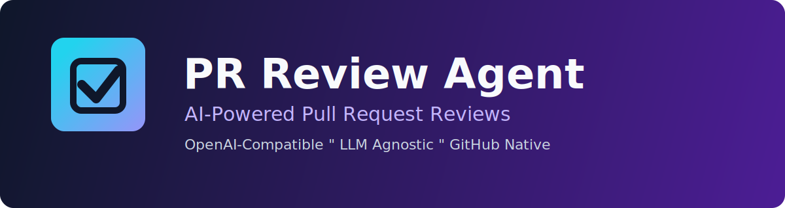
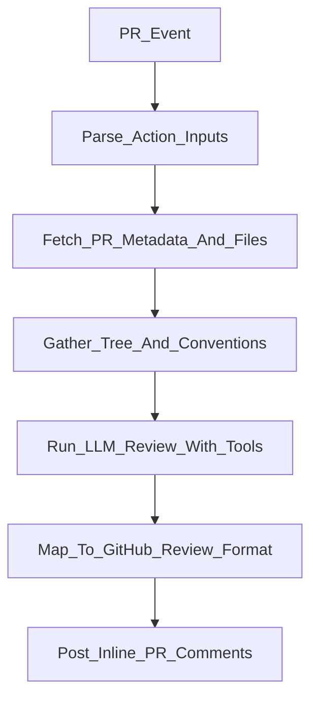

# PR Review Agent

[](https://github.com/tushardhole/pr-review-agent/actions/workflows/ci.yml)
[](./LICENSE)
[](https://nodejs.org/)

AI-powered pull request review for GitHub Actions. Works with any OpenAI-compatible LLM API.

---

## Quick Start

1. Add `OPENAI_API_KEY` to repository secrets.
2. Create `.github/workflows/pr-review.yml`.
3. Open or update a PR.

```yaml
name: AI Code Review

on:
  pull_request:
    types: [opened, synchronize, reopened]

permissions:
  contents: read
  pull-requests: write

jobs:
  review:
    runs-on: ubuntu-latest
    steps:
      - uses: actions/checkout@v4
      - uses: tushardhole/pr-review-agent@v1
        with:
          github_token: ${{ secrets.GITHUB_TOKEN }}
          openai_api_key: ${{ secrets.OPENAI_API_KEY }}
          model: gpt-4o
```

## Features

- LLM agnostic via OpenAI-compatible API (`openai_base_url` + `model`)
- Reviews on PR open, sync, and reopen events
- Inline review comments with severity tags
- Automatically reads conventions (`CONTRIBUTING`, lint/style files)
- Tool-based context expansion (`read_file`) when model needs more context
- File filtering with glob patterns and max-file limit
- Strict TypeScript, Jest unit tests, and integration coverage

## How It Works

The action reads PR metadata and changed files, collects repository conventions, builds a structured review prompt, and calls your configured LLM.  
If needed, the model asks to read additional files through a controlled `read_file` tool.  
The final JSON review result is mapped into GitHub review comments and posted in one review.



## Configuration

| Input | Required | Default | Description |
|---|---|---|---|
| `github_token` | Yes | - | Token for GitHub API access (use `secrets.GITHUB_TOKEN`) |
| `openai_api_key` | Yes | - | API key for OpenAI-compatible provider |
| `openai_base_url` | No | `https://api.openai.com/v1` | Base URL for provider endpoint |
| `model` | No | `gpt-4o` | Model identifier |
| `exclude_patterns` | No | empty | Comma-separated globs to skip files |
| `max_files` | No | `20` | Maximum changed files to review |
| `review_level` | No | `thorough` | `quick`, `thorough`, or `security-focused` |
| `extra_prompt` | No | empty | Extra instruction appended to prompt |
| `max_context_rounds` | No | `3` | Max tool-call rounds for additional file reads |

### Debug Observability (Environment Variables)

Use these optional environment variables on the action step when diagnosing provider output issues:

- `DEBUG_LLM_RESPONSE` (`true`/`false`, default `false`) - enable LLM debug logs
- `DEBUG_LLM_RESPONSE_MAX_CHARS` (default `4000`) - truncate debug payload output
- `DEBUG_LLM_RESPONSE_REDACT` (`true`/`false`, default `true`) - redact token-like secrets from debug logs

Example usage:

```yaml
- uses: tushardhole/pr-review-agent@v1
  env:
    DEBUG_LLM_RESPONSE: "true"
    DEBUG_LLM_RESPONSE_MAX_CHARS: "2500"
    DEBUG_LLM_RESPONSE_REDACT: "true"
  with:
    github_token: ${{ secrets.GITHUB_TOKEN }}
    openai_api_key: ${{ secrets.OPENAI_API_KEY }}
```

By default, user-facing review comments hide internal diagnostics (for example, dropped inline anchors). These details are only surfaced in the review body when debug mode is enabled.

## Provider Examples

### OpenAI (default)

```yaml
with:
  github_token: ${{ secrets.GITHUB_TOKEN }}
  openai_api_key: ${{ secrets.OPENAI_API_KEY }}
  model: gpt-4o
```

### Azure OpenAI

```yaml
with:
  github_token: ${{ secrets.GITHUB_TOKEN }}
  openai_api_key: ${{ secrets.AZURE_OPENAI_KEY }}
  openai_base_url: https://YOUR_RESOURCE_NAME.openai.azure.com/openai/deployments/YOUR_DEPLOYMENT
  model: gpt-4o
```

### Ollama (self-hosted)

```yaml
with:
  github_token: ${{ secrets.GITHUB_TOKEN }}
  openai_api_key: ollama
  openai_base_url: http://YOUR_RUNNER_HOST:11434/v1
  model: llama3.1:8b
```

### OpenRouter

```yaml
with:
  github_token: ${{ secrets.GITHUB_TOKEN }}
  openai_api_key: ${{ secrets.OPENROUTER_API_KEY }}
  openai_base_url: https://openrouter.ai/api/v1
  model: openai/gpt-4o-mini
```

### Groq

```yaml
with:
  github_token: ${{ secrets.GITHUB_TOKEN }}
  openai_api_key: ${{ secrets.GROQ_API_KEY }}
  openai_base_url: https://api.groq.com/openai/v1
  model: llama-3.3-70b-versatile
```

## Review Output Example

Example inline review comment body:

```text
[Critical] Potential SQL injection risk in query construction.
Use parameterized query placeholders instead of string interpolation.
```

## Permissions

This action requires:

- `contents: read` to fetch file tree and file contents
- `pull-requests: write` to post review comments

`GITHUB_TOKEN` is created automatically by GitHub Actions for each run.

## Contributing

- Run `npm run lint`
- Run `npm test`
- Run `npm run package`
- Open a PR with clear context and test notes

## Release and Marketplace

### Versioning strategy

- Publish immutable tags like `v1.0.0`, `v1.0.1`, etc.
- Keep a moving major tag (`v1`) that points to the latest stable `v1.x.y` release.
- Consumers should use `@v1` in workflows for safe updates.

### Release checklist

1. Ensure `main` is green (`CI` + dogfood workflow).
2. Run locally:
   - `npm run lint`
   - `npm test`
   - `npm run package`
3. Confirm `dist/index.js` is up to date and committed.
4. Create and push release tags:
   - `git tag v1.0.0`
   - `git tag -f v1 v1.0.0`
   - `git push origin v1.0.0`
   - `git push origin v1 --force`
5. Create GitHub Release from `v1.0.0`.
6. Publish/list in GitHub Marketplace from the repo release UI.

## License

MIT
